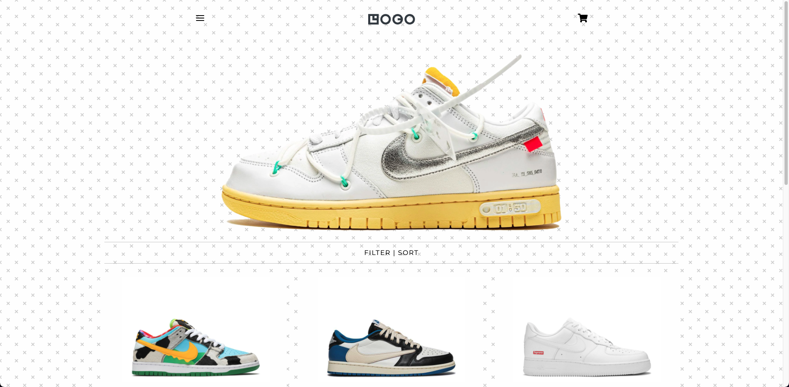

# 01 Project - Online Shop

An online sneaker store that helps hypebeast/high fashion shoe enthusiasts get access to the latest and greatest sneakers.

## Dependencies

This project uses the following systems together in order for it to operate smoothly:

-   [React](https://reactjs.org/)
-   [Stripe](https://stripe.com/)
-   [Begin](https://begin.com/)

## Prerequisites

-   [Node.js](https://nodejs.org/)

## Local Development

1. Run `npm install`
2. Run `npm start` to start developnment server
3. Open `src/App.js` to get started

### Links

-   Link to shop on [Netlify](https://marvelous-squirrel-27b689.netlify.app/)
-   Link to shop on [Begin](https://sunny-kly-staging.begin.app)
